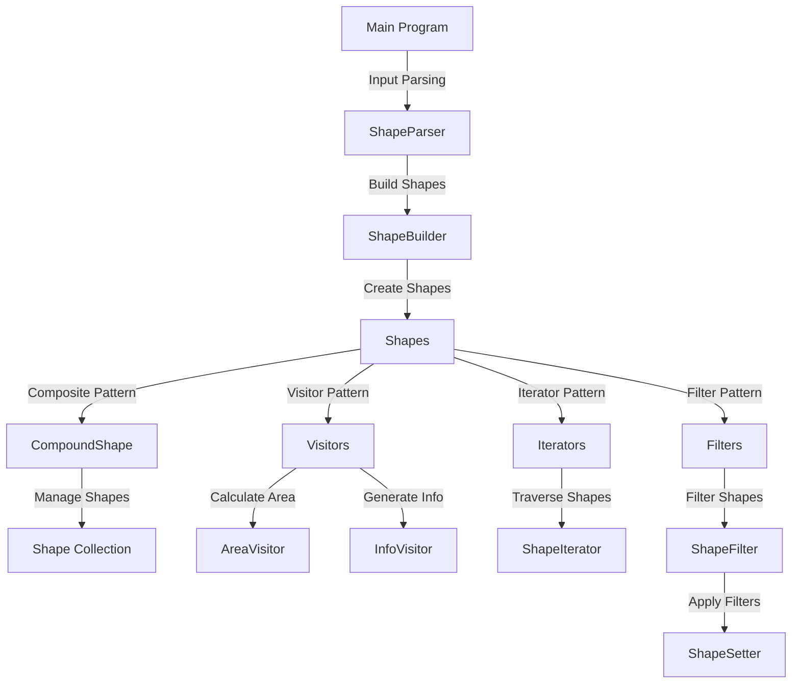

# Pattern-oriented Software Design - POSD

## Table of Contents

1. [Introduction](#introduction)
    - [What is Design Patterns](#what-is-design-patterns)
2. [Design Patterns Used in This Repository](#design-patterns-used-in-this-repository)
3. [Folder Structure and Purpose](#folder-structure-and-purpose)
4. [System Architecture Overview](#system-architecture-overview)
5. [Setting Up the Environment to Build This Repository](#setting-up-the-environment-to-build-this-repository)
   - [Prerequisites](#prerequisites)
   - [Building the Project](#building-the-project)
   - [Cleaning the Build](#cleaning-the-build)

## Introduction

This project demonstrates the application of pattern-oriented software design principles in C++. It includes implementations of various design patterns to manage shapes and their operations.

### [What is Design Patterns](https://henriquesd.medium.com/design-patterns-introduction-220f811db857)

Design Patterns are models of code that solve classic problems. They are solutions to software design problems that you can find in a real-world application. A Design Pattern is not a code that is ready to be used in your application, but it is a model that you can use to solve a problem.
Design patterns are language neutral, so they can be applied to any language that supports object-orientation.

## Design Patterns Used in This Repository

This repository demonstrates the use of several design patterns to solve common software design problems. Below is a list of the design patterns implemented:

1. **Composite Pattern**
   - Used to represent and manage compound shapes that can contain other shapes. This allows treating individual shapes and groups of shapes uniformly.

2. **Visitor Pattern**
   - Enables operations (like calculating area or generating info) to be performed on shapes without modifying their classes.

3. **Iterator Pattern**
   - Provides a way to traverse shapes in a compound structure, such as iterating through the components of a compound shape.

4. **Builder Pattern**
   - Used to construct shapes and compound shapes incrementally, providing a flexible way to create complex objects.

5. **Filter Pattern**
   - Allows filtering shapes based on specific criteria, such as area, perimeter, or type.

These patterns are implemented in the `src/` folder and are tested extensively in the `test/` folder.

## Folder Structure and Purpose

### `src/`

This folder contains the core implementation of the project, including:

- **Shape Classes**: Represent individual shapes like rectangles, ellipses, and triangles.
- **CompoundShape**: Implements the Composite Pattern to manage groups of shapes.
- **Visitors**: Implements the Visitor Pattern for operations like calculating area and generating info.
- **Iterators**: Implements the Iterator Pattern to traverse shapes in a compound structure.
- **Filters**: Implements the Filter Pattern to filter shapes based on criteria like area, perimeter, or type.
- **Builders**: Implements the Builder Pattern to construct shapes and compound shapes incrementally.
- **Utilities**: Provides helper functions for shape management and filtering.

### `test/`

This folder contains unit tests for all major components of the project. It uses Google Test to validate the functionality of:

- Shape classes (e.g., `ut_rectangle.h`, `ut_ellipse.h`, `ut_triangle.h`)
- Compound shapes (`ut_compound_shape.h`)
- Visitors (`ut_visitor.h`)
- Iterators (`ut_iterator.h`)
- Filters (`ut_filter.h`)
- Builders (`ut_shape_builder.h`)
- Parsers (`ut_shape_parser.h`)
- Sorting (`ut_sort.h`)
- Terminal interaction (`ut_terminal.h`)

### `bin/`

This folder stores the compiled binaries of the project.

### `obj/`

This folder stores the compiled object files (`.o`) generated during the build process.

### Root Files

- **`makefile`**: Automates the build process, including compilation and testing.
- **`README.md`**: Provides documentation for the project.
- **`input.txt`**: Example input file for testing or demonstration purposes.

## System Architecture Overview

This diagram illustrates the relationships between the main components and the design patterns used in the repository.
